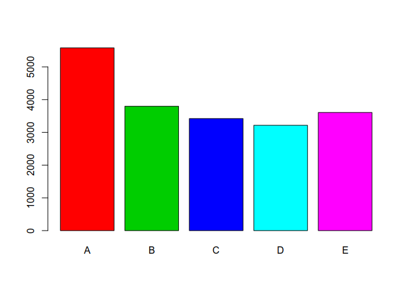
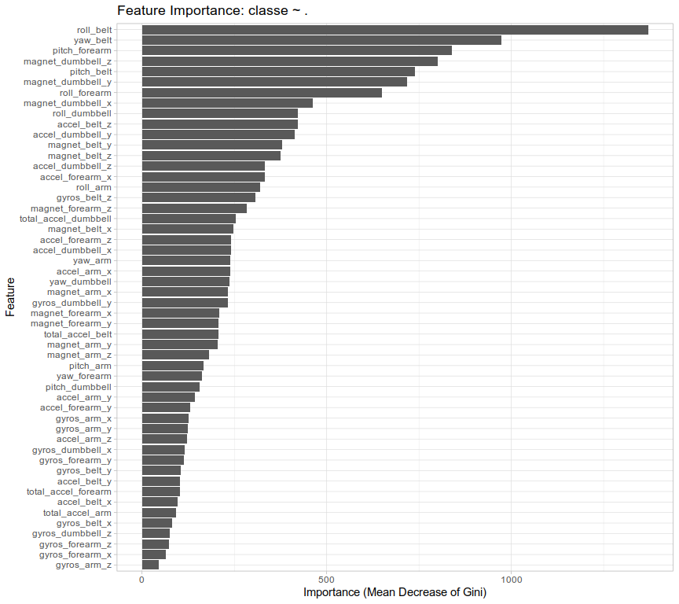
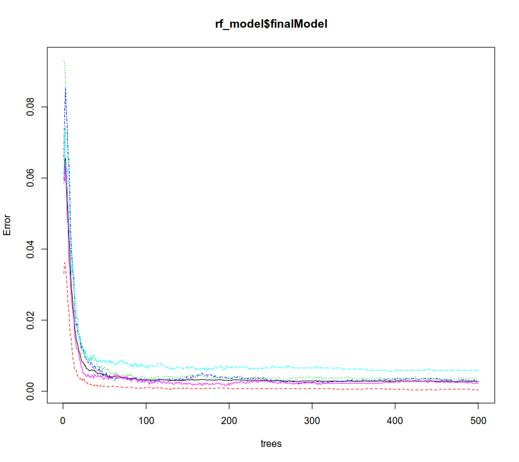

## Background

Using devices such as Jawbone Up, Nike FuelBand, and Fitbit it is now possible to collect a large amount of data about personal activity relatively inexpensively. These type of devices are part of the quantified self movement – a group of enthusiasts who take measurements about themselves regularly to improve their health, to find patterns in their behavior, or because they are tech geeks. One thing that people regularly do is quantify how much of a particular activity they do, but they rarely quantify how well they do it. In this project, our goal is to use data from accelerometers on the belt, forearm, arm, and dumbell of 6 participants. They were asked to perform barbell lifts correctly and incorrectly in 5 different ways. More information is available from the website: [Human Activity Recognition](http://groupware.les.inf.puc-rio.br/har) (see the section on the Weight Lifting Exercise Dataset). 

The goal of this project is to predict the manner in which the participants did the exercise. This is the "classe" variable in the training set. We will describe how we built our model using cross validation. We will report an estimate of the expected out of sample error of our model. Finally we will use our prediction model to predict 20 different test cases for validation. 

## Getting the data

The data for this project come from this source: [http://groupware.les.inf.puc-rio.br/har](http://groupware.les.inf.puc-rio.br/har)

The first step in our analysis is to download the data sets and have a look on their dimensions, their values and structure. We also look for NA values. The output is not shown since there are 19622 observations of 160 variables in the training set and 20 observations of 160 variables on the test set. The training set contains the categorical variable *classe* which is the ground truth class the observation belongs to. The test set does not contain this variable and we must predict its value. Instead the test set contains a variable called *problem_id* and this is why both sets have 160 variables. 


```
## [1] "Training set dimensions: "
```

```
## [1] 19622   160
```

```
## [1] "Test set dimensions: "
```

```
## [1]  20 160
```
Let's have a look at the distribution of values for the "classe" variable in the training set:


```
## [1] "Class labels:"
```

```
## [1] A B C D E
## Levels: A B C D E
```

```
## [1] "Distribution of the classes:"
```

<!-- -->

## Cleaning the data

Now let's do some cleaning. The first thing we noticed in our exploratory analysis was the presence of a lot of NA values in many of the variables. NA values will cause problems in the training phase of our model. There are 100 variables in the training set that contain more than 95% NA values. We drop all of this variables from both the training and the test set. We next drop the variables that hold timestamp values ("raw_timestamp_part_1", "raw_timestamp_part_2", "cvtd_timestamp") and timing window information ("new_window", "num_window"). Finally we drop the *user_name* and the record count variable ("V1"). At the end we have a training set with 53 variables without NA values. 

We keep the same variables on the test set (we drop the problem_id variable), so we keep only 52 variables. We leave the test set aside for now since we want to use it for the validation of our final model.


```
## [1] "Number of columns that contain NA values more than 95%: 100"
```

```
## [1] "Training set dimensions: "
```

```
## [1] 19622    53
```

```
## [1] "Test set dimensions: "
```

```
## [1] 20 52
```

```
## [1] "Number of NA values in the training set: 0"
```
## Building a Model

We will build a random forest model as our prediction model. The idea of using random forests came from the authors of the paper [*Qualitative Activity Recognition of Weight Lifting Exercises*](http://groupware.les.inf.puc-rio.br/public/papers/2013.Velloso.QAR-WLE.pdf) from which the data sets for this project were obtained.

We will use the caret package for training with 10 fold repeated cross validation with 3 repeats (this approximately runs for a half an hour on an Intel i5 processor). We use a train control object for this process. This processes will lead to an unbiased model because of k-fold cross validation. We use 3 repeats to avoid over-fitting.

For model tuning we have the hyperparameter 'mtry' which controls the number of variables available for splitting at each tree node. In a separate experiment (it took around 5 hours to run) we used a grid search for the values 5 up to 15 for 'mtry' and we found that the value 9 yields the best model. Thus we use this value for tuning the hyperparameter mtry. For the number of trees to try we left the default value of 500. For the training we use the metric of the accuracy of the model and the method is 'rf' which stands for random forest. We use all the variables as predictors (52 predictors) in our model.


```
##     user   system  elapsed 
## 1848.205   12.439 1881.640
```

Let's examine some of the model properties:

```
## Random Forest 
## 
## 19622 samples
##    52 predictor
##     5 classes: 'A', 'B', 'C', 'D', 'E' 
## 
## No pre-processing
## Resampling: Cross-Validated (10 fold, repeated 3 times) 
## Summary of sample sizes: 17659, 17660, 17661, 17660, 17660, 17660, ... 
## Resampling results:
## 
##   Accuracy   Kappa    
##   0.9966875  0.9958099
## 
## Tuning parameter 'mtry' was held constant at a value of 9
```



```
## 
## Call:
##  randomForest(x = x, y = y, mtry = param$mtry) 
##                Type of random forest: classification
##                      Number of trees: 500
## No. of variables tried at each split: 9
## 
##         OOB estimate of  error rate: 0.27%
## Confusion matrix:
##      A    B    C    D    E  class.error
## A 5578    1    0    0    1 0.0003584229
## B    9 3784    4    0    0 0.0034237556
## C    0    9 3412    1    0 0.0029222677
## D    0    0   17 3197    2 0.0059079602
## E    0    0    1    7 3599 0.0022179096
```



We observe that our model has 99.67% accuracy and just 0.27% OOB (Out Of Bag) error rate so we expect it to have a really good performance in the validation phase using the test set data. One nice thing with the random forest model is that it provides us information on variable (feature) importance while building the model.

## Prediction

Now it's time to validate our model on the test set. Using the course quiz to validate our model we achieved 100% accuracy in predicting the correct class!


```
##  [1] B A B A A E D B A A B C B A E E A B B B
## Levels: A B C D E
```


